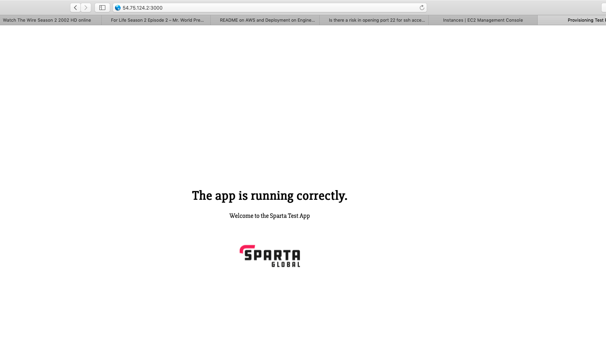
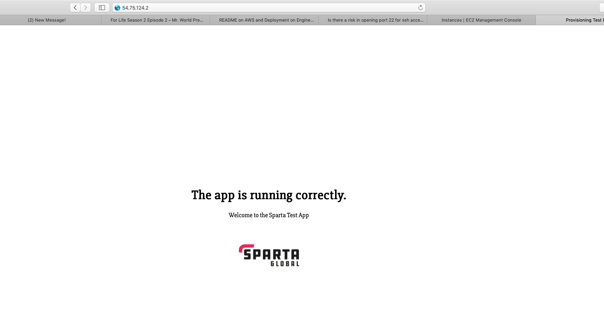

# Cloud and AWS
This repo answers various questions in regards to Cloud computing and AWS

### What is the cloud?
Cloud computing is the on-demand availability of computer system resources. This is usually data storage and computing power. With Cloud Computing there is no need for direct management from the user.

### What is AWS?
Amazon Web Services provides on-demand cloud computing platforms and APIs to individuals, companies and governments. Pay as you go basis. Provided by Amazon

### What is EC2?
Elastic Compute Cloud is a web service that provides secure resizable compute capacity in the cloud. It is used to make web-scale cloud computing easier for developers. It is part of Amazon's AWS.

### What is a SG? how do you open a port to your ip? and to the world?
SG stands for security group. It acts as a virtual firewall for the instances within EC2. It controls ingoing and outgoing traffic. To open your port to the world and/or to your ip, you go to the security groups section on your instance, and edit the inbound rules. There you can choose the port for the HTTP, SSH, Custom TCP and more.

### Why should we not have port 22 open to all ips?
Having open ports in the server allows attackers to be able to gain access to your server.

### Where do wer keep our ssh keys?
We keep our ssh keys in the `~/.ssh` directory

### How do you ssh into a remote server?
`ssh -i <ssh_key_name> ubuntu@<public ip adress>`

### How do you send in 1 file to remote server?
`scp -i ~/.ssh/ssh_key <file_name> ubuntu@<public_ip>:~/ubuntu/file_name`
*NOTE!* - This command should be used once you are already in the folder where the file you're copying exists. Otherwise the file_name in the first part of the command needs to show the absolute path.

### How do you send in multiple files to remote server?
`scp -i <ssh_key_name> -r folder ubuntu@serverip:~/destination`
*NOTE!* - This command should be used once you are already in the folder where the file you're copying exists. Otherwise the folder in the first part of the command needs to show the absolute path. `-r` will look at all the files within the folder

### General outline of ops to get app running correctly

### Picture of App running on port 3000 and 80
* Here is the app running on port 3000

* Here is the app running on port 80

### Testing if app on private IP port 3000 - curl privateip:3000